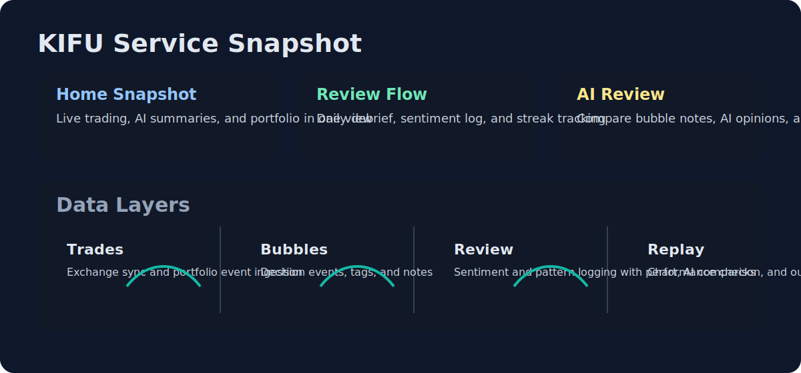

# KIFU

**거래 복기와 AI 검증을 통해 의사결정 품질을 개선하는 트레이딩 저널 플랫폼**

[🇺🇸 English](./README.md) · [🇰🇷 한국어](./README.ko.md)



KIFU는 거래/포트폴리오 활동을 다음 루프로 정리합니다.
- 거래·포트폴리오 이벤트 수집
- 판단 기록과 복기 노트 작성
- AI 의견을 실제 결과와 비교
- 지속적인 의사결정 개선

## KIFU가 해결하는 문제

1. 거래 후 데이터가 여러 도구로 분산되어 판단 근거가 사라짐
2. AI 조언을 실제 성과와 비교하기 어렵고 신뢰도 평가가 모호함
3. 복기 루틴이 불규칙해 개선 포인트가 축적되지 않음

KIFU는 이를 `수집 → 기록 → 복기 → 개선` 흐름으로 통합합니다.

## 핵심 기능

- 거래·포트폴리오 수집(거래소 동기화, CSV 임포트, 수동 입력)
- AI 의견 저장 및 비교 분석
- 감정/패턴/근거 기록용 레이어 기반 복기 세션
- 버블 타임라인 + 차트 리플레이 대조
- KPI 대시보드 및 성과 분석
- 알림, 인증, 토큰 관리

## Summary Pack

### v1.0 (기본)
- 클라이언트가 `source_run_id`를 직접 전달해 요약 팩 생성
- 소스 제어가 명확하고 재현성이 높음

### v1.1 (확장)
- 서버가 사용자의 최신 완료 run을 자동 선택
- 신규 API: `POST /api/v1/packs/generate-latest`
- 완료된 run이 없으면 `NO_COMPLETED_RUN` 반환

> 자세한 스펙: `docs/spec/summary-pack-v1.md`, 운영 가이드: `docs/runbook/summary-pack-v1.md`

## 아키텍처

- Backend: Go + Fiber
- Frontend: React + TypeScript + Vite
- Data: PostgreSQL, Redis
- AI Provider: OpenAI / Claude / Gemini

## 빠른 시작

```bash
# 저장소 복사
# git clone https://github.com/nyuk/kifu.git
cd kifu-project

# Backend
cd backend
cp .env.example .env
go mod download
go run ./cmd

# Frontend (새 터미널)
cd frontend
cp .env.example .env
npm install
npm run dev
```

- Backend: `http://localhost:8080`
- Frontend: `http://localhost:5173`

## 문서

- 설계: `docs/01-plan/*`, `docs/02-design/*`
- 스펙: `docs/spec/*`
- 운영: `docs/runbook/*`
- 분석: `docs/03-analysis/*`
- NLM 정리: `docs/nlm/*`

## GitHub 소개 텍스트(About)

GitHub 저장소 소개글(About)은 기본적으로 단일 문구라서 기본 언어는 영어로 두고, 한국어는 리드미 링크로 제공하는 방식이 권장됩니다.

- 권장 설명
  - `Trading journal and AI review platform for retrospective analysis: bubbles, portfolio, chart replay, and AI comparison.`
- 권장 태그
  - `trading`, `journal`, `review`, `trading-journal`, `go`, `fiber`, `react`, `vite`, `ai`, `portfolio`, `chart`

## 마케팅

- X(트위터) 운영 가이드: `docs/marketing/twitter-playbook.md`
- 게시물 샘플: `docs/marketing/x-post-queue.sample.json`

## Contributing

1. Issue 또는 PR로 제안
2. 변경 범위와 동작 영향, 테스트 범위를 명확히 기술
3. 운영 영향(보안/데이터/성능)을 함께 정리

## 라이선스

배포 전 `LICENSE` 또는 프로젝트 정책을 확인하세요.
